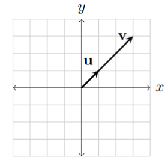

## Definition
Scalar multiplication is simply the multiplication of a vector by a scalar (number). Formally:

$$
\mathbf v = c \cdot \mathbf u \; where \; \mathbf u \in \mathbb R^n \; and \; c \in \mathbb R
$$

## More Context
It satisfies the distributive property:

$$
c(\mathbf u + \mathbf v) = c \mathbf u + c \mathbf v
$$

It satisfies the associative property:

$$
(cd) \mathbf v = c (d \mathbf v)\; where\; c,d \in R
$$

It satisfies the Identity property:

$$
\begin{align*}
1 \mathbf v &= \mathbf v\\
0 \mathbf v &= 0
\end{align*}
$$

It can also be represented graphically and using matrices.
### Graphical Representation

$\mathbf v = 3\mathbf u$

### Matrix Representation

$$
\mathbf v = 3 \cdot \begin{bmatrix} 1 \\ 1 \end{bmatrix} = \begin{bmatrix} 3 \cdot 1 \\ 3 \cdot 1 \end{bmatrix} = \begin{bmatrix} 3 \\ 3 \end{bmatrix}
$$

## Further  Reading
- [[Vectors]]
- [[Vector Addition]]
