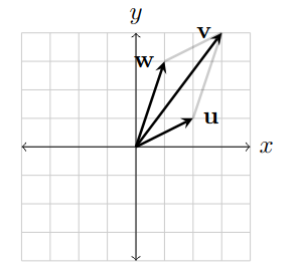
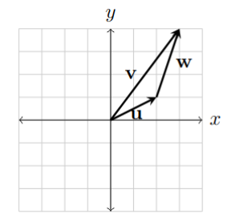

## Definition
Vector addition as the name suggests, is the addition of vectors. Formally:

$$
\mathbf v = \mathbf u + \mathbf w \; where \; \mathbf v, \mathbf u, \mathbf w \in \mathbb R^n
$$

## More Context
It is commutative and associative:

$$
\begin{align*}
\mathbf u + \mathbf v &= \mathbf v + \mathbf u \\
(\mathbf v + \mathbf u) + \mathbf w &= \mathbf u + (\mathbf v + \mathbf w)
\end{align*}
$$

It can also be represented graphically or using matrices.
### Graphical Vector Addition

$\mathbf v$ is the sum of $\mathbf u$ and $\mathbf w$. The general idea is that $\mathbf v$ should move the straight line distance of $\mathbf u$ and $\mathbf w$ as well as their net direction.
### Matrix Representation

$$
\mathbf v  = \begin{bmatrix} 2 \\ 1 \end{bmatrix} + \begin{bmatrix} 1 \\ 3 \end{bmatrix} = \begin{bmatrix} 2 + 1 \\ 1 + 3 \end{bmatrix} = \begin{bmatrix} 3 \\ 4 \end{bmatrix}
$$

## Further Reading
- [[Vectors]]
- [[Scalar Multiplication]]
