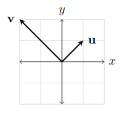

## Definition
A vector can be defined in two ways. A vector can be defined as an arrow in  with a given length and a given direction. It could also be defined as an ordered list of numbers. How we choose to define a vector doesn't matter as much as the relationship between these two views and how we translate from one representation to another.

## More Context
### Vectors as Arrows in Space

### Vectors as Matrices (List of Numbers)

$$
\mathbf u = \begin{bmatrix} 1 \\ 1 \end{bmatrix},
\mathbf v = \begin{bmatrix} -2 \\ 2 \end{bmatrix}
$$

## Key Points
- Two fundamental operations are carried out on vectors: [[Vector Addition|vector addition]] and [[Scalar Multiplication|scalar multiplication]].
- A linear combination of one or more vectors is an expression where each vector is multiplied by a scalar and then subbed together. Formally:

$$
c \mathbf{u} + d \mathbf{v} + e\mathbf{w}
$$ 
  where $\mathbf u, \mathbf v, \mathbf w$ are vectors and $c, d, e$ are scalars.
- A vector space is a set of vectors.
- The span of one or more vectors are all the vectors that can be produced by the linear combination of those vectors.

$$
span(\mathbf v_1, \mathbf v_2, ..., \mathbf v_n) = c_1 \mathbf v_1 + c_2 \mathbf v_2 + ... + c_n \mathbf v_n \; | \; c_1, c_2, ..., c_n \in \mathbb R
$$

- A vector is linearly dependent on other vectors if it can be expressed as a linear combination of those vectors. Otherwise, it is linearly independent.
- A basis of a vector space is a set of linearly independent vectors that span the space.

## Further Reading
- [[Vector Addition]]
- [[Scalar Multiplication]]
